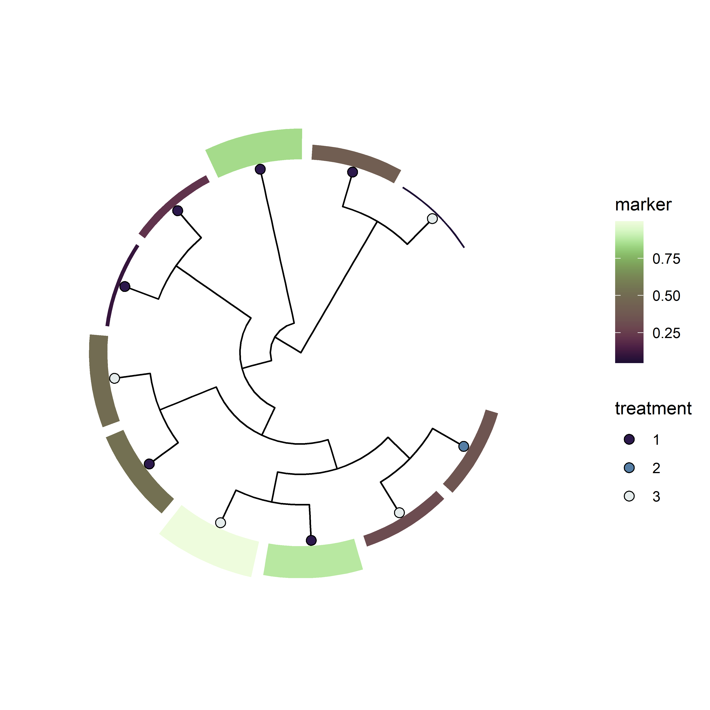

<!-- README.md is generated from README.Rmd. Please edit that file -->

# stana

<!-- badges: start -->

[](https://github.com/noriakis/stana/actions/workflows/R-CMD-check.yaml)
[](https://www.codefactor.io/repository/github/noriakis/stana)
<!-- badges: end -->

Metagenotyping analysis in R. Import and analyse, plot output of the
software like [MIDAS](https://github.com/snayfach/MIDAS),
[MIDAS2](https://github.com/czbiohub/MIDAS2), [metaSNV v1, metaSNV
v2](https://github.com/metasnv-tool/metaSNV) and
[inStrain](https://github.com/MrOlm/inStrain). Primarly developed for
`MIDAS` and `MIDAS2`.

The documentation is available using `pkgdown` at
<https://noriakis.github.io/software/stana_pkgdown>. The detailed usage
is available at <https://noriakis.github.io/software/stana>, using
`bookdown`.

## Installation

Using `devtools`:

``` r
devtools::install_github("noriakis/stana")
```

## Pipeline


## Examples

``` r
## Using example data
library(stana)
load(system.file("extdata", "sysdata.rda", package = "stana"))

stana
#> Type: MIDAS2
#> Directory: midas2_sample_merge_uhgg
#> Species number: 1
#> Filter type: group, number: 1, proportion: 0.8
#> Loaded SNV table: 1
#>   Species cleared SNV filter: 1
#> Loaded gene table (copynum): 1
#>   Species cleared gene filter: 1
#> 7.2 Mb
getID(stana)
#> [1] "100003"

## Make example metadata
samples <- getSlot(stana, "snps")[[1]] |> colnames()
metadata <- data.frame(
    row.names=samples,
    treatment=sample(1:3, length(samples), replace=TRUE),
    marker=runif(length(samples))
)


## Set metadata
stana <- setMetadata(stana, metadata)

## Call consensus sequence
## Infer and plot tree based on metadata
stana <- stana |>
  consensusSeq(argList=list(site_prev=0.95)) |>
  inferAndPlotTree(meta=c("treatment","marker"))
#> Beginning calling for 100003
#>   Site number: 5019
#>   Profiled samples: 11
#>   Included samples: 11
getFasta(stana)[[1]]
#> 11 sequences with 896 character and 625 different site patterns.
#> The states are a c g t
getTree(stana)[[1]]
#> 
#> Phylogenetic tree with 11 tips and 9 internal nodes.
#> 
#> Tip labels:
#>   ERR1711593, ERR1711594, ERR1711596, ERR1711598, ERR1711603, ERR1711605, ...
#> 
#> Unrooted; includes branch lengths.
getTreePlot(stana)[[1]]
```



## Interactive inspection

The users can inspect metagenotyping results interactively using Shiny
based on the variables such as disease conditions
(`exportInteractive()`).
